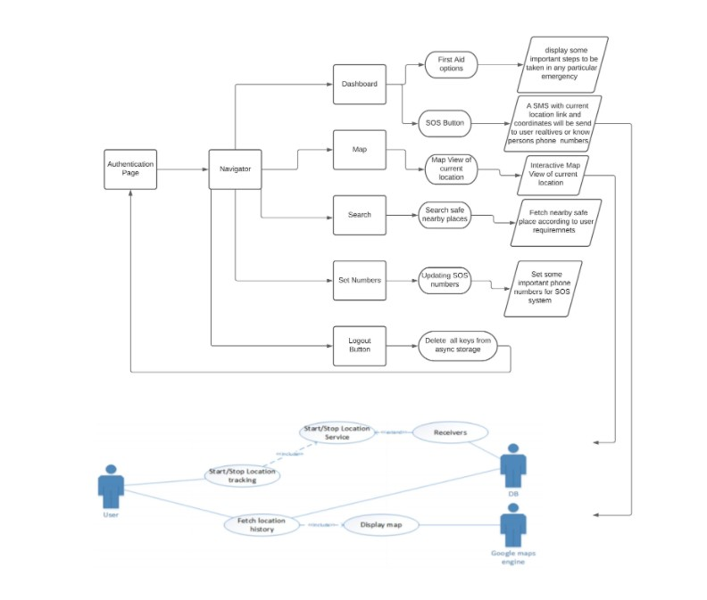

<h1>Doot!</h1>
  

Doot app is SOS system incase of any emergency or accidents such as earthquake, suddenly person suffer heart attack, road accidents etc.The app also display steps to be taken incase of any such accidents.The SOS system will automatically send the message to the known persons phone numbers with victim's current locations and coordinates current  of the user with location.

The app also gives facility to search nearby hospitals and hotels and other safe places thus also allow user to know his/her current location.

The app also provide SOS system for women safety thereby giving them facility to search nearby police stations and other required locations.

<h1>DOOT! app flow controls</h1>
  

<h1>To run App:</h1>
You must install expo-cli and node-js to your system.

install node-js -> https://nodejs.org/en/    (better to use LTS version)

install expo-cli -> https://expo.io/

For downloading expo-cli open commannd prompt and type:

             npm install --global expo-cli

 Download Zip or clone:

   open file location in a command prompt and run following commands:
         
         cd <Project directory location>

         npm install

         npm start
 
